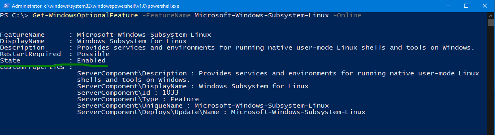
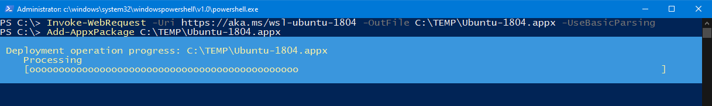

# Enable Windows 10 with Ubuntu 18.04 on Windows Subsystem fro Linux (WSL)

## Enable Hyper-V
Microsofts Hyper-V must be enabled, as Windows Subsystem for Linux (WSL) relies on it.

### Check if Hyper-V is already enabled
Open an elevated PowerShell (Search for PowerShell, click with right mouse button and select "run as administrator")
```PowerShell
Get-WindowsOptionalFeature -FeatureName Microsoft-Hyper-V-All -Online
```


If "State" is shown as enabled, skip the "Install Hyper-V" step.

### Install Hyper-V
```PowerShell
Enable-WindowsOptionalFeature -Online -FeatureName Microsoft-Hyper-V -All
```
--> *reboot required*

### Check if WSL is enabled
```PowerShell
Get-WindowsOptionalFeature -FeatureName Microsoft-Windows-Subsystem-Linux -Online
````


If "State" is shown as enabled, skip the "Enable WSL" step.


### Enable WSL
```PowerShell
Enable-WindowsOptionalFeature -Online -FeatureName Microsoft-Windows-Subsystem-Linux
```
--> *reboot required*

## Download the Ubuntu 18.04 from Linux

```PowerShell
mkdir C:\TEMP
Invoke-WebRequest -Uri https://aka.ms/wsl-ubuntu-1804 -OutFile C:\TEMP\Ubuntu-1804.appx -UseBasicParsing
```

--> not reboot required

## Install the Ubuntu
Watch out for disk consumtion.
If you started PowerShell as elevated user (aka "Administrator"), the ubuntu.apx has been download into the actual path, 
which is usuallyc:\windows\system32 - good practice is to move it straight away into a software repository top save space on your
C: drive!

```PowerShell
Add-AppxPackage C:\TEMP\Ubuntu-1804.appx
```



# Start Ubuntu Bash/WSL

## Install latest Patches

### Refresh Update List (???)
```bash
sudo apt update
````

### Run Package Upgrade
```bash
sudo apt upgrade
````

## Prepare the Environment

### Install Python and PIP

```bash
sudo apt install python3-dev python3-pip
```

### Install dependencies

Download requirements.txt (link)
```bash
pip install -r requirements.txt
````

### Install Bazel

Dateils can be found here: https://docs.bazel.build/versions/master/install-ubuntu.html

Prepare
```bash
sudo apt install curl
curl https://bazel.build/bazel-release.pub.gpg | sudo apt-key add -
echo "deb [arch=amd64] https://storage.googleapis.com/bazel-apt stable jdk1.8" | sudo tee /etc/apt/sources.list.d/bazel.list
```
Install
```bash
sudo apt update && sudo apt install bazel-2.0.0
sudo apt update && sudo apt full-upgrade
```

Install JDK 
```bash
sudo apt install openjdk-11-jdk
```

## Build Tensorflow 


```bash
git clone https://github.com/tensorflow/tensorflow.git
```

```bash
cd tensorflow
./configure
bazel build //tensorflow/tools/pip_package:build_pip_package

```


