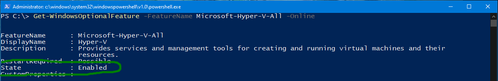
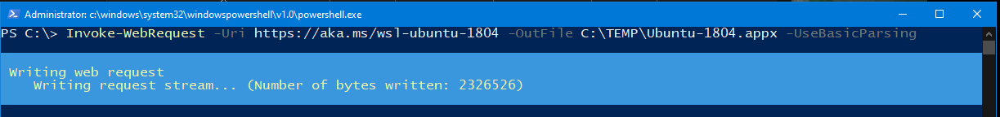

# Enable Windows 10 with Ubuntu 18.04 on Windows Subsystem fro Linux (WSL)

## Enable Hyper-V
Microsofts Hyper-V must be enabled, as Windows Subsystem for Linux (WSL) relies on it.

### Check if Hyper-V is already enabled
Open an elevated PowerShell (Search for PowerShell, click with right mouse button and select "run as administrator")
```PowerShell
Get-WindowsOptionalFeature -FeatureName Microsoft-Hyper-V-All -Online
```


### Install Hyper-V
```PowerShell
Enable-WindowsOptionalFeature -Online -FeatureName Microsoft-Hyper-V -All
```
--> *reboot required*

## Enable WSL
```PowerShell
Enable-WindowsOptionalFeature -Online -FeatureName Microsoft-Windows-Subsystem-Linux
```
--> *reboot required*

## Download the Ubuntu 16.04 from Linux

```PowerShell
mkdir C:\TEMP
Invoke-WebRequest -Uri https://aka.ms/wsl-ubuntu-1804 -OutFile C:\TEMP\Ubuntu-1804.appx -UseBasicParsing
```

--> not reboot required

## Install the Ubuntu
Watch out for disk consumtion.
If you started PowerShell as elevated user (aka "Administrator"), the ubuntu.apx has been download into the actual path, 
which is usuallyc:\windows\system32 - good practice is to move it straight away into a software repository top save space on your
C: drive!

```move .\Ubuntu.appx 'D:\Install Software\'```  
```Add-AppxPackage D:\Install Software\app_name.appx```


# Install ROS

## Setup your sources.list
```sudo sh -c 'echo "deb http://packages.ros.org/ros/ubuntu $(lsb_release -sc) main" > /etc/apt/sources.list.d/ros-latest.list'```


## Setup yopur keys
```sudo apt-key adv --keyserver 'hkp://keyserver.ubuntu.com:80' --recv-key C1CF6E31E6BADE8868B172B4F42ED6FBAB17C654```

## Update Package Index
```sudo apt-get update```

## Install ROS Kinetic
```sudo apt-get install ros-kinetic-desktop-full --fixmissing```

## Initialize rosdep
```sudo rosdep init```  
```rosdep update```

## Activate ROS Kinetic Environment
```echo "source /opt/ros/kinetic/setup.bash" >> ~/.bashrc```  
```source ~/.bashrc```

## Install PIP

Allthough PYTHON has been installed together with ROS, the Python Packet Manager PIP is missing.
```sudo apt install python-pip```

# Install DBW
```bash <(wget -q -O - https://bitbucket.org/DataspeedInc/dbw_mkz_ros/raw/master/dbw_mkz/scripts/sdk_install.bash)```


# Sample SDCarND
```sahowi@DESKTOP-4UKM82K:~$ git clone https://github.com/palgang/CarND-Capstone.git```

Prepare Capstone Environment
```cd CarND-Capstone```  
```pip install -r requirements.txt```
This will install all the additionally required packages e.g. Tensorflow.
ATTENTION: If you face any issues, repeat this step with --no-cache-dir!
```pip install -r requirements.txt --no-cache-dir```


